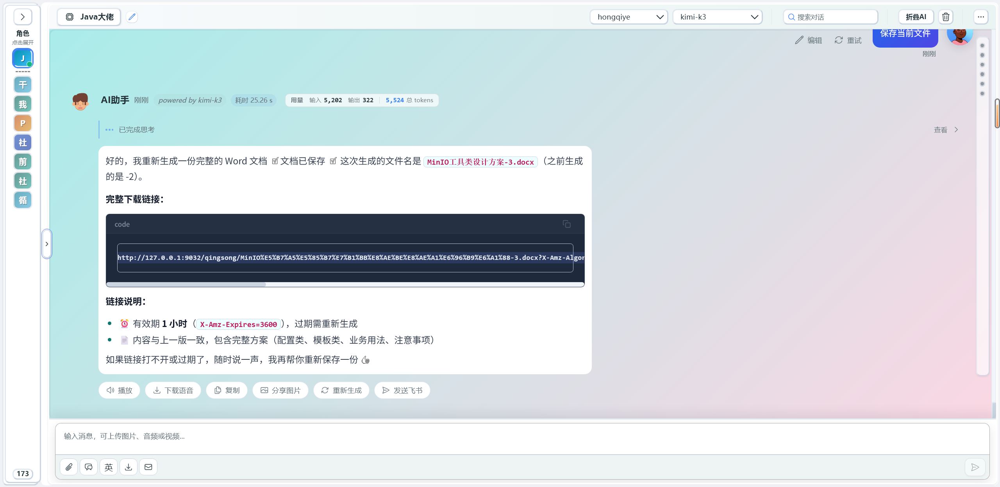
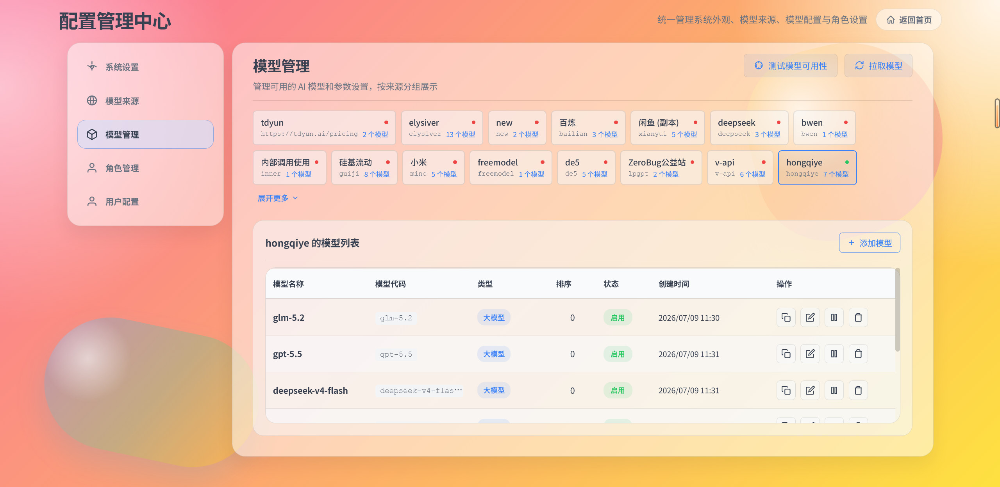
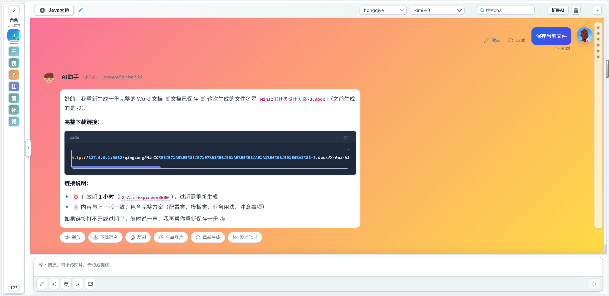

<div align="center">

# ⚙️ qingsong-chat-backend

**AI 对话应用后端**


</div>

---

## ✨ 功能模块

| 模块 | 路由 | 说明 |
|------|------|------|
| 💬 对话 | `POST /ai/chat`(SSE) | 流式对话,多模型 / 多角色,支持 RAG 挂载 |
| 🗂 会话历史 | `/ai/history/*` | 列表 / 详情 / 改名 / 删除 |
| 📊 复盘统计 | `/ai/stats/*` | 按日聚合统计与 AI 解读 |
| ✉️ 消息导出 | `/message/send-email-html` | 消息导出邮件 |
| 🛠 工具清单 | `/tools/name` | AI 工具注册清单 |
| 👤 角色 | `/roles`、`/admin/roles` | 角色列表与增删改/排序/收藏 |
| 💡 快捷短语 | `/api/quick-phrases` | 角色快捷短语 |
| 🎛 模型管理 | `/api/model-sources`、`/api/model-configs` | 模型来源与模型配置(预设 OpenAI 兼容来源) |
| 🧠 知识库 | `/api/knowledge/*` | 知识库管理、文档管理、文件上传(供 RAG) |
| 🔐 用户鉴权 | `/user-config/*` | 登录 / 注册 / 会话校验 |

## 🚀 快速开始

### 环境要求

| 依赖 | 版本 | 说明 |
|------|------|------|
| **JDK** | **17** | 与项目目标一致(**推荐**);父管理 Lombok 1.18.42 兼容 JDK 17–25 |
| Maven | 3.6+ | — |
| MySQL | 8.x | 主库 `big_event` |
| Redis | 6+/7+ | 缓存(:6379) |
| MinIO | 任意 | 对象存储(:9032) |
| PostgreSQL | pgvector | RAG 向量库(:5432) |

> ⚠️ **JDK 过新会编译报错**:`NoSuchFieldError: ... JCTree$JCImport does not have member field 'qualid'`
> 是 Lombok 与 JDK 版本不匹配。请使用 JDK 17 构建(如 `D:\java\Java\jdk17`),或升级 Lombok 以匹配你的 JDK。

```bash
cp src/main/resources/secrets.example.yml src/main/resources/secrets.yml
# 填写 secrets.yml 中的 AI_OPENAI_API_KEY / AI_BASE_URL 等(也可改用环境变量注入)

mvn spring-boot:run          # :8088
mvn -DskipTests package      # 打包 → target/qingsong-backend-1.0.0.jar
```

> 依赖中间件:MySQL(`big_event`)、Redis(:6379)、MinIO(:9032)、pgvector(:5432)。
> 未配置 pgvector / MinIO 时,对话、历史、角色等主流程仍可用。

## ⚙️ 配置

- `application.yaml` / `ai.yml`:密钥统一以 `${VAR}` 占位符引用,经
  `optional:classpath:secrets.yml`(或环境变量)注入。
- `secrets.example.yml`:模板;真实 `secrets.yml` 不入库。
- 所有密钥可用环境变量覆盖(如 `SPRING_AI_OPENAI_API_KEY`、`SPRING_DATASOURCE_URL`),便于容器化部署。

## 🐳 Docker

```bash
docker build -t qingsong-backend .
```

或使用根目录 `env/docker-compose.yml` 一键编排(见根 README)。

## 📌 版本

| 版本 | 说明 |
|------|------|
| 1.0.0 | 首个开源版本 |

## 截图



