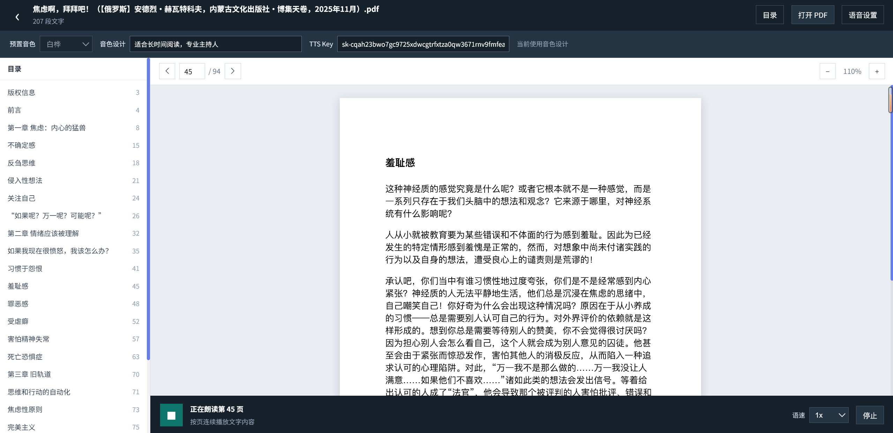

# qingsong-chat-backend

AI 对话应用后端。**版本 1.0.0**(Maven artifact:`com.qingsong:qingsong-backend:1.0.0`)。

技术栈:**Spring Boot 3.5 + Java 17 + Maven + MyBatis-Plus + Sa-Token + Spring AI + Reactor + MySQL + Redis + pgvector + MinIO**。

## 功能模块

| 模块 | 路由 | 说明 |
|------|------|------|
| 对话 | `/ai/chat`(SSE) | 流式对话,多模型/多角色 |
| 会话历史 | `/ai/history/*` | 列表/详情/改名/删除 |
| 复盘统计 | `/ai/stats/*` | 按日聚合统计与解读 |
| 消息导出 | `/message/send-email-html` | 消息导出邮件 |
| 工具清单 | `/tools/name` | AI 工具注册清单 |
| 角色 | `/roles`、`/admin/roles` | 角色列表与管理 |
| 快捷短语 | `/api/quick-phrases` | 角色快捷短语 |
| 模型来源/配置 | `/api/model-sources`、`/api/model-configs` | 模型管理 |
| 知识库 | `/api/knowledge/bases` | RAG 知识库列表 |
| 用户鉴权 | `/user-config/*` | 登录/注册/会话校验 |

**AI 工具**:对话中可被模型调用(`/tools/name` 返回清单),由 `tools` 包注册。

## 运行

```bash
cp src/main/resources/secrets.example.yml src/main/resources/secrets.yml
# 填写 secrets.yml 中的 AI_OPENAI_API_KEY / AI_BASE_URL 等(也可改用环境变量注入)

mvn spring-boot:run          # :8088
mvn -DskipTests package      # 打包 target/*.jar
```

> 依赖中间件:MySQL(`big_event`)、Redis(:6379)、MinIO(:9032)、pgvector(:5432)。
> 未配置 pgvector/MinIO 时,对话/历史/角色等主流程仍可用。

## Docker

```bash
docker build -t qingsong-backend .
```
或直接使用根目录 `docker-compose.yml` 一键编排(见根 README)。

## 配置

- `application.yaml` / `ai.yml`:密钥统一以 `${VAR}` 占位符引用,经
  `optional:classpath:secrets.yml`(或环境变量)注入。
- `secrets.example.yml`:模板;真实 `secrets.yml` 不入库。
- 所有密钥可用环境变量覆盖(如 `SPRING_AI_OPENAI_API_KEY`、`SPRING_DATASOURCE_URL`),便于容器化部署。

## 版本

| 版本 | 说明 |
|------|------|
| 1.0.0 | 首个开源版本 |



